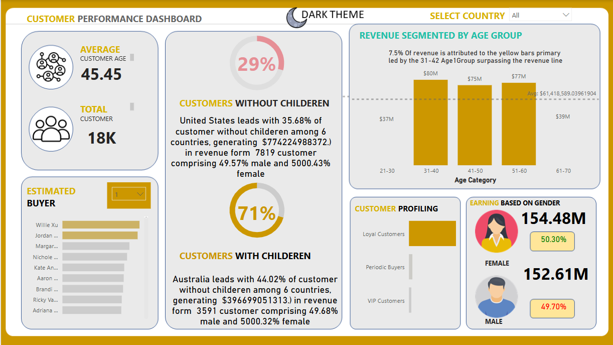
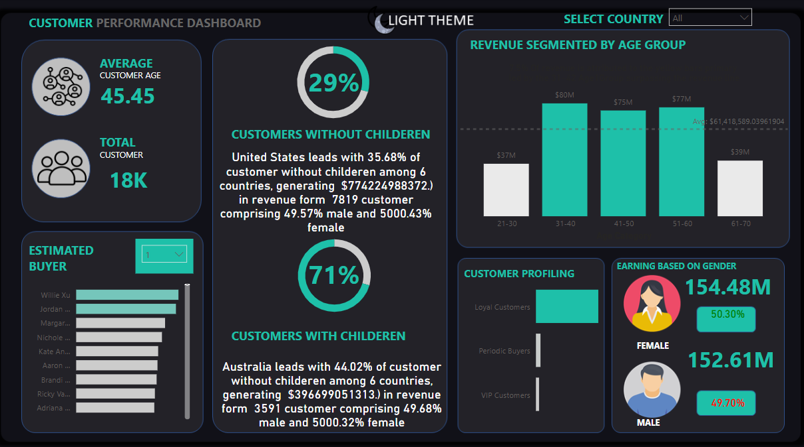

# Customer-Performance-Dashboard Power-Bi Project

This **Power BI** project presents an interactive **Customer Performance Dashboard** with both **Light Mode** and **Dark Mode** themes. The dashboard provides valuable insights into customer demographics, revenue segmentation, and purchasing behavior.

## 📊 Dashboard Overview

- **Average Customer Age:** Displays the mean age of customers.
- **Total Customers:** Shows the total number of customers.
- **Estimated Buyer List:** Ranks customers based on estimated purchases.
- **Revenue Segmentation by Age Group:** Highlights revenue contributions across different age categories.
- **Customer Profiling:** Categorizes customers into **Loyal Customers, Periodic Buyers, and VIP Customers**.
- **Earnings by Gender:** Compares revenue generated by male and female customers.
- **Customer Insights by Family Status:** Compares revenue and customer distribution **with and without children**.

## 📷 Dashboard Views

### Light Mode:

### Dark Mode:

## Dataset Used:

##  Tools & Technologies Used
- **Power BI** – Data visualization and dashboard creation.
- **DAX (Data Analysis Expressions)** – Used for advanced calculations and insights.
- **Excel Dataset** – 

##  Insights & Use Cases
- Helps businesses understand **customer demographics and purchasing trends**.
- Provides data-driven insights for **marketing strategies and revenue optimization**.
- Assists in **customer segmentation** for better-targeted campaigns.

##  How to Use
1. **Download** the Power BI file from this repository.
2. **Open in Power BI Desktop**.
3. **Interact with filters and visualizations** to explore customer insights.

##  Future Enhancements
- Integration of real-time data sources.
- Advanced AI-driven customer segmentation.
- Predictive analytics for revenue forecasting.

